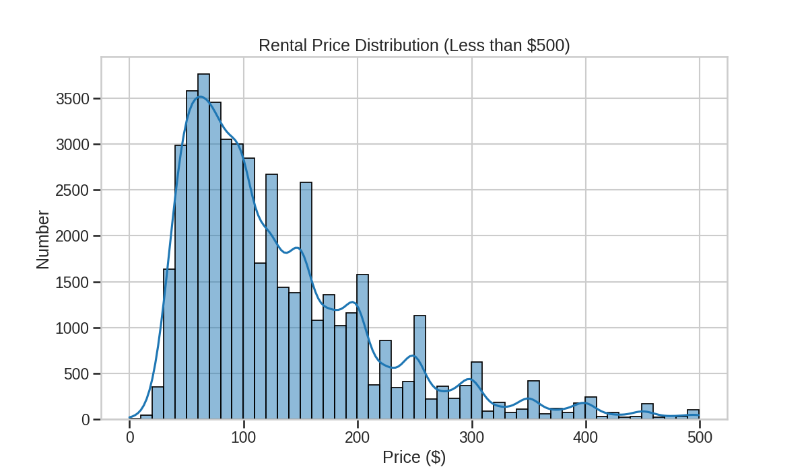
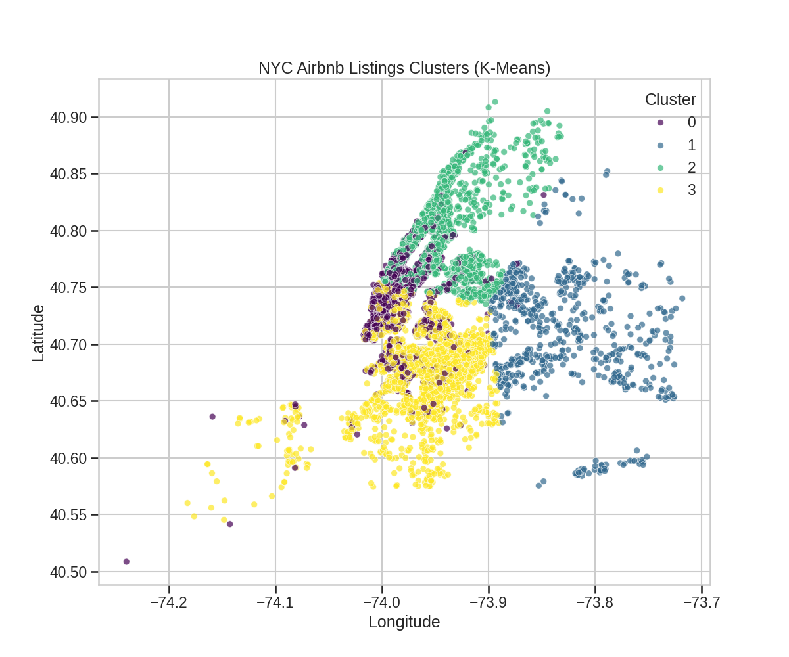

# 📊 تحليل وتوقع أسعار إعلانات Airbnb في مدينة نيويورك

<p align="center">
  
  
  
</p>

---

## 📖 جدول المحتويات
1. [نظرة عامة على المشروع](#-نظرة-عامة-على-المشروع)
2. [البيانات المستخدمة](#-البيانات-المستخدمة)
3. [التحليل المطبق](#-التحليل-المطبق)
4. [أبرز النتائج](#-أبرز-النتائج)
5. [كيفية تشغيل المشروع](#-كيفية-تشغيل-المشروع)
6. [هيكل المشروع](#-هيكل-المشروع)
7. [الترخيص (License)](#-الترخيص)

---

## 🎯 نظرة عامة على المشروع
هذا المشروع يقدم تحليلاً شاملاً لبيانات Airbnb في مدينة نيويورك. الهدف هو استكشاف العوامل المؤثرة على أسعار الإيجارات، وبناء نماذج تعلم آلة قادرة على التنبؤ بنوع الغرفة وسعرها، بالإضافة إلى اكتشاف التجمعات الجغرافية للإعلانات المتشابهة.

---

## 💾 البيانات المستخدمة
تم استخدام مجموعة بيانات "New York City Airbnb Open Data" المتاحة على Kaggle. تحتوي البيانات على معلومات تفصيلية حول ~49,000 إعلان، وتشمل ميزات مثل:
* الموقع الجغرافي (`latitude`, `longitude`)
* المنطقة (`neighbourhood_group`)
* نوع الغرفة (`room_type`)
* السعر (`price`)
* الحد الأدنى لليالي (`minimum_nights`)
* عدد التقييمات (`number_of_reviews`)

---

## 🔬 التحليل المطبق
تم تقسيم العمل إلى ثلاث مراحل رئيسية:
1.  **تحليل البيانات الاستكشافي (EDA):** تم فحص توزيع البيانات والعلاقات بين المتغيرات المختلفة باستخدام تصورات بيانية.
2.  **النمذجة الإشرافية (Supervised Learning):**
    * **تصنيف (Classification):** بناء نماذج (Logistic Regression, KNN, Naive Bayes) للتنبؤ بـ `room_type`.
    * **انحدار (Regression):** بناء نموذج (Random Forest) للتنبؤ بـ `price`.
3.  **النمذجة غير الإشرافية (Unsupervised Learning):**
    * **تجميع (Clustering):** استخدام خوارزمية K-Means لتقسيم الإعلانات إلى مجموعات بناءً on الموقع والسعر.

---

## ✨ أبرز النتائج

### 1. أداء نماذج التصنيف
تم تقييم النماذج بناءً على دقتها (Accuracy) ومقياس F1-score.

| النموذج                 | Accuracy | F1-score (Weighted Avg) |
| ------------------------ | :------: | :---------------------: |
| **Logistic Regression** |  `XX.X%` |         `X.XX`          |
| **K-Nearest Neighbors** |  `XX.X%` |         `X.XX`          |
| **Naive Bayes** |  `XX.X%` |         `X.XX`          |

### 2. نتائج نموذج توقع السعر
نموذج Random Forest استطاع تفسير **~65%** من التباين في أسعار الإعلانات (`R² = 0.65`). متوسط الخطأ في التنبؤ كان حوالي **$XX.XX**.



### 3. نتائج التجميع (Clustering)
تم تحديد 4 مجموعات رئيسية للإعلانات، تظهر توزيعًا جغرافيًا واضحًا يتوافق مع أسعار المناطق المختلفة.



---

## 🚀 كيفية تشغيل المشروع

### المتطلبات الأساسية
* Python 3.9 أو أحدث
* Git

### خطوات التشغيل
1.  **انسخ المستودع (Clone the repo):**
    ```bash
    git clone [https://github.com/](https://github.com/)[Your-Username]/[Your-Repo-Name].git
    cd [Your-Repo-Name]
    ```

2.  **(مستحسن) أنشئ بيئة افتراضية:**
    ```bash
    python -m venv venv
    source venv/bin/activate  # On Windows use `venv\Scripts\activate`
    ```

3.  **ثبّت المكتبات المطلوبة:**
    قم بإنشاء ملف `requirements.txt` أولاً (انظر الشرح بالأسفل) ثم نفذ الأمر:
    ```bash
    pip install -r requirements.txt
    ```

4.  **شغّل سكربت التحليل:**
    ```bash
    python analysis.py
    ```

---

## 📂 هيكل المشروع
```
.
├── 📂 data/
│   └── data1.csv
├── 📂 images/
│   └── ... (All plots)
├── 📜 analysis.py
├── 📜 .gitignore
├── 📜 README.md
└── 📜 requirements.txt
```

---

## ⚖️ الترخيص
هذا المشروع مرخص بموجب ترخيص MIT. انظر ملف `LICENSE` لمزيد من التفاصيل.
